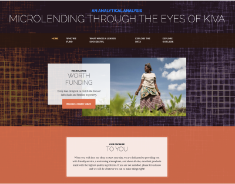

# TeamPySpark

 
Link to dashboard (or link to video of dashboard demonstration)

 [Google Slides Presentation](https://docs.google.com/presentation/d/1_PMTb9D7JATLUvOpR_WDij9qfOgb7B80TdIEhfzbzYs/edit?usp=sharing)

Selected topic
## Microloans from the loan recipient's perspective

#### Why microlending?
Microlending has been a game changing way to address international poverty, social equity, and lack of educational parity.  Kiva, started in 2005 by a young couple, launched a new strategy to effect social impact through microlending: focus on the progress of the people rather than the situational poverty.  This landmark mindshift catalyzed a social movement where all people, everywhere are empowered to give opportunities to the world's most oppressed individuals at an unimaginable scale -- providing loans of more than $1 Billion dollars to date in 99 countries.

#### Microloans are an important tool to help small entrepreneurs launch businesses.  
Today income inequality is the worst in decades.  We have seen this in the US and globally where the rich get richer, the poor struggle more and the middle class of many societies is hollowed out.  

##### Data utilized to complete the analysis:
Kiva.org provides robust snapshot data from their database semi-regularly. The snapshot includes three databases:

      * Loans: which describes the individual loan
      * Lenders: which contains details about the lenders who bolster the community
      * Loans_lenders: which includes information about the individual ventures that are funded including country, descriptions, tags and categories, and relevant funding information.
      * Additional relevant data was discovered on Kaggle about Kiva loan locations.
      * Additionally, the PySpark team sought out a datasource from the United Nations which provides an array of critical metrics about the countries where these loans are issued.

##### Questions the team hopes to answer with the data
Often when analysts look at microloans, the lens and argument is that even though the loans are small and for those who do not have means, the repayment rates are quite attractive, in that few of these loans default.  So analysis has centered on looking at what defaults, avoiding defaults and predicting the best loans to make.  All this analysis is from the perspective of the LENDER.

Given that the idea of microloans is to help those without means use entrepreneurship and small loans to catapult themselves out of poverty, we wanted to look at the FACTORS that make a loan application successful, in that they get a loan and the loan is then repaid, thus the business application was successful.  If we can use regression analysis to identify the most important factors that lead to a client being successful, we can create a visualization and app so they can see what they might change in order to raise their chances of success in both getting the loan and having the business be successful.

##### Description of the data exploration phase of the project
Through the data exploration pre-processing steps, the team examined how the databases interconnected through entity relationship diagrams.  Additionally field values were unlocked and mapped to their column names. Columns with an overwhelming amount of null data were accessed for their feasibility in the data examination.  Signs with multiple string values that could be reassigned to categorial groups for ease in analysis were cleaned with functions that made the data easier to manipulate for use in machine learning tools.  Additionally, a column was added to the dataset that found the difference in time between two separate date columns to identify time to funding -- a data value that became critical to the machine learning framework that was used. 

##### Description of the analysis phase of the project
Normally for lending questions, it would be a binary classification challenge.  We look at it from the perspective of the borrower, ie what are the components of the application and business that led the loan to be succesful?  Thus we use regression analysis to see which elements of the application drive the most likelihood of success.

Using regression analysis does create one challenge: what is the Y variable?  If all the loans in the Kiva.org data are actual loans, how can we define success.  We are looking at %funded vs goal, number of lenders a project attracts, and the dollar per lender as measures that lenders on the platform found that loan attractive and thus more likely to receive funding.

## Technological Components

##### Technologies, languages, tools, and algorithms used throughout the project
    Github, Jupyter notebook, pandas, SQL, Postgres, PGAdmin, QuickDBD, Scikitlearn

##### Data Cleaning and Analysis
Pandas will be used to clean the data and perform an exploratory analysis. Further analysis will be completed using Python.   We will also use simple exploratory functions in excel.

##### Database Storage
SQL is the database we intend to use, utilizing PGAdmin and Postgres, and we have built an ERD and have joined several sources of data.  Finally, we will integrate Flask as a pipeline to display the data.

##### Machine Learning
SciKitLearn is the ML library we'll be using to create a classifier. We plan to use unsupervised machine learning and potentially linear regression as our target is the elements that drive success, not the binary outcome of success.  Our training and testing setup is currently scaling, PCA and then classification using K-Means, but this may migrate to Random Forest or back to linear regression as we optimize our models.

##### Dashboard
Bootstrap tools are integrated with JavaScipt code to create a website that will communicate project results and impact.  Interactive tools that rely on D3 selectors will empower site visitors to browse the variety of portfolios of exprience that lenders have with as part of the Kiva community.   will be used for website design, using D3.js for a fully functioning and interactive dashboard, and javascript plotly for graphs. 

## Analytical outcomes and future analysis

##### Result of analysis

##### Recommendation for future analysis

##### Anything the team would have done differently

## References

